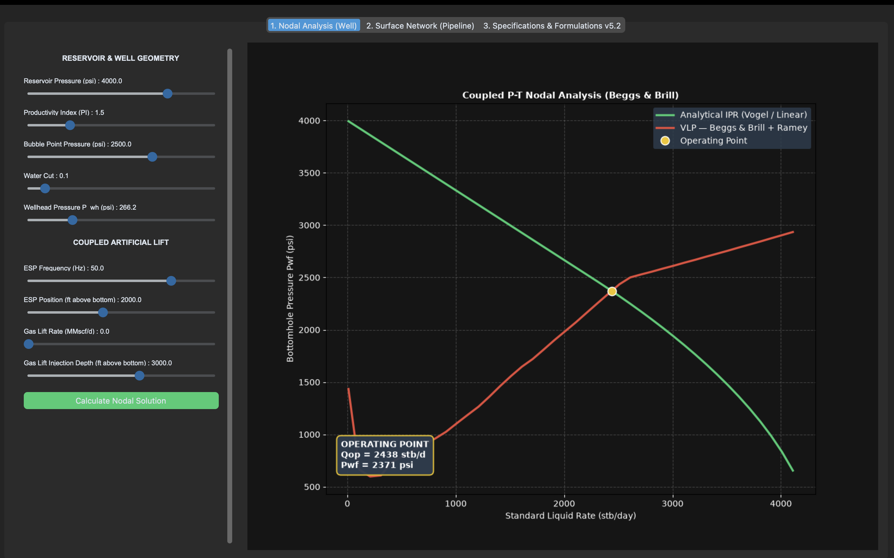

# PRO-SIM v5.2

## Python-Based Well Performance & Nodal Analysis Simulator

PRO-SIM is an educational petroleum-engineering simulation project developed in Python to explore well performance, multiphase flow and nodal analysis through an interactive graphical interface.

### Main engineering components

- Black-oil PVT property calculations using Standing/Beggs-Robinson correlations
- Multiphase pressure-gradient calculations using Beggs & Brill (1973)
- Flow-regime identification and liquid holdup calculations
- Vogel-based IPR modelling
- VLP / wellbore pressure-profile calculation
- Synthetic ESP performance modelling
- Gas-lift input and segmented gas-rate treatment
- Coupled pressure-temperature wellbore calculation using a Ramey-style thermal formulation
- Surface pipeline pressure-profile simulation
- Numerical solution of the well operating point
- Interactive GUI using CustomTkinter and Matplotlib
## Nodal Analysis Demo

The simulator calculates the well operating point from the intersection of the IPR and VLP curves.



Example case:
- Reservoir Pressure: 4000 psi
- Productivity Index: 1.5 stb/d/psi
- Bubble Point Pressure: 2500 psi
- Water Cut: 10%
- ESP Frequency: 50 Hz
- Operating Point: 2438 stb/d
- Bottomhole Pressure: 2371 psi

### Project structure

```text
PRO-SIM/
├── main.py
├── physics.py
├── solver.py
├── gui_tabs.py
├── reports.py
├── requirements.txt
├── README.md
├── TECHNICAL_NOTES.md
└── assets/
    └── nodal-analysis.png
```

### How it works

The simulator couples an inflow model (IPR) with a calculated wellbore/outflow response (VLP). The operating point is obtained numerically from the pressure residual between the inflow and wellbore calculations.

The wellbore model evaluates PVT properties, multiphase flow behaviour and pressure-gradient contributions along the well depth. Artificial-lift inputs can be varied to study their effect on the calculated operating condition.

### Technologies

Python · NumPy · Matplotlib · CustomTkinter

### Engineering scope and limitations

This project is a personal educational/engineering prototype. It is intended for learning, numerical experimentation and demonstrating petroleum-engineering modelling skills. It is **not** a commercial simulator and its correlations, assumptions, fluid properties, ESP performance data and thermal parameters are not intended to replace validated field software or calibrated well data.

### Author

Kone Mohamed Yahaya  
MSc Student in Petroleum & Gas Engineering
